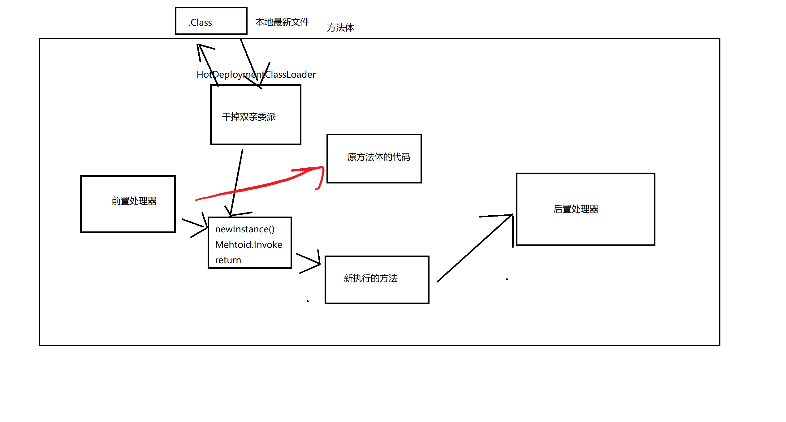

# MyHotDeployment

## 7.16
**mod** HotDeploymentClassLoader, 当热部署的文件夹找不到类,则往上从父类里面找; 
**add** 程序启动的时候自动把上传的class部署到IOC容器中 
**add** 部署的是Controller,则将url的映射注册到IOC容器中; 
**fix** 修改单独打包,无法运行的问题; 
**mod** 将启动时从磁盘载入部署的信息从EventStart改到RefreshEvent; 
**mod** 重写HotDeploymentClass的equals和hashcode,当部署的路径、类名、包名一致的时候,认为是同一个对象。 

## 8.1
**add** 将原对象进行缓存,方便后期的字节码回溯; 
**add** 定义三种部署方式; 
**add** 开启Agent的远程调用。 

<h1>AMS熱部署原理</h1>
